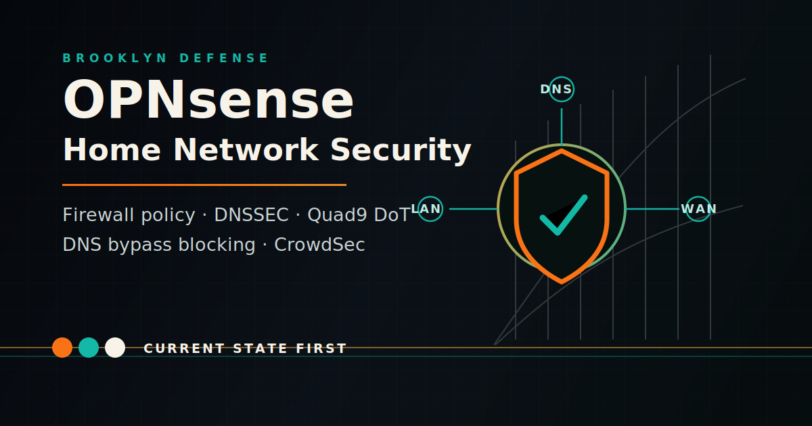
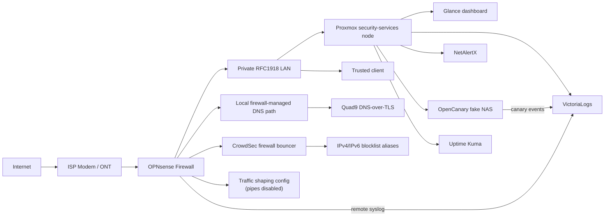
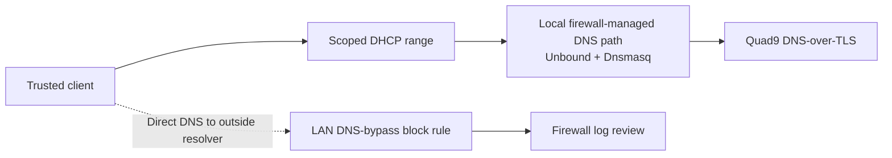
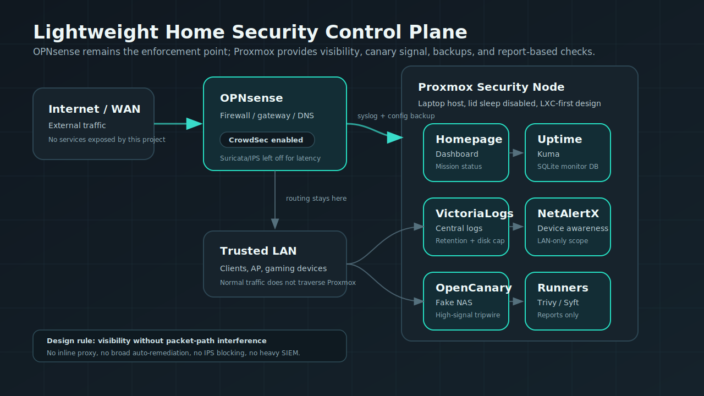

# Home Network Security

  

Live OPNsense firewall and lightweight Proxmox security control plane for a personal network: firewall policy, DNS security, CrowdSec blocking, centralized logs, asset awareness, deception, uptime monitoring, safe on-demand scanning, and operational documentation.

The build runs on repurposed hardware: a small mini PC for OPNsense and a recycled 8 GB laptop as the Proxmox security-services node. That constraint is intentional in the documentation because the project is about practical defensive value on equipment that has to stay stable, quiet, and useful in a real home network.

This repository documents a live personal network build without publishing sensitive configuration exports, public IPs, secrets, hostnames, or private management details. The goal is to show engineering decisions, security controls, and operational habits without turning the network into a target map.

## At A Glance

- OPNsense edge firewall with DHCP WAN and a single trusted LAN.
- Repurposed mini PC used as the OPNsense firewall.
- Recycled 8 GB laptop used as the Proxmox security-services node.
- WAN configured to block private networks and bogon networks.
- Private RFC1918 LAN with a scoped DHCP range for trusted clients.
- Unbound DNS enabled on port 53 with DNSSEC and DNS-over-TLS forwarding to Quad9.
- Dnsmasq enabled on LAN for DHCP/local host registration support, listening on an alternate local DNS port.
- Firewall rule blocks LAN clients from bypassing local DNS by sending DNS directly to non-approved resolvers.
- CrowdSec agent, local API, and firewall bouncer enabled with IPv4/IPv6 blocklist aliases.
- Suricata IDS configuration is present but currently disabled.
- WireGuard and OpenVPN are present in the config tree but currently disabled/not instantiated.
- Traffic-shaping queues and rules exist for gaming/latency prioritization, with pipes currently disabled.
- Lightweight Proxmox control plane added with LXCs for monitoring, logs, discovery, canary services, config backup, and on-demand scanners.
- VictoriaLogs receives firewall and canary logs with short retention and disk caps.
- NetAlertX provides local unknown-device awareness without aggressive scanning.
- OpenCanary acts as a fake internal NAS/server for high-signal interaction alerts.
- Uptime Kuma monitors core services using SQLite to keep RAM use low.
- Glance provides a one-page daily operations dashboard.
- Nuclei, Trivy, and opnDossier are available only as manual runners, not scheduled scans.
- Administrative access kept private and scoped to trusted LAN access.
- Documentation-first approach: design notes, redaction rules, change tracking, and validation checklist.

## Architecture

## DNS Enforcement Flow

This is the control that makes the setup more than a default home firewall: clients are expected to use the resolver path the firewall can validate and log, while direct DNS bypass attempts are blocked.

## Security Goals

This project is built around practical defensive goals:

- Reduce attack surface by keeping inbound services closed unless explicitly required.
- Keep LAN clients on the firewall-controlled DNS path.
- Use DNSSEC and DNS-over-TLS to improve resolver integrity and privacy.
- Use CrowdSec firewall blocking to add reputation-based protection.
- Keep the current single-LAN design documented so later segmentation can be added deliberately.
- Keep firewall administration private, deliberate, and documented.
- Preserve evidence of design decisions without exposing reusable attack information.

## Case Study

**Problem:** A home network can quietly become hard to reason about: DNS bypasses local controls, firewall rules drift, plugins get enabled without review, and documentation falls behind the real configuration.

**Approach:** I reviewed the exported OPNsense configuration, separated current controls from future work, and documented the setup without publishing sensitive network details.

**Evidence reviewed:** WAN/LAN interface roles, scoped DHCP model, Unbound and Dnsmasq settings, Quad9 DNS-over-TLS forwarding, LAN DNS-bypass blocking, CrowdSec configuration, Suricata status, VPN status, and traffic-shaping state.

**What I would check next:** recurring backup validation, firmware/plugin update cadence, DNS path testing from multiple clients, CrowdSec blocklist health, and whether segmentation is worth adding based on actual device trust boundaries.

**Result:** The public writeup describes what is configured, what stays private, and what remains future work.

## Proxmox Security Control Plane

The second phase adds a lightweight Proxmox-based security-services node. It was built with a simple rule: improve visibility without putting anything in the traffic path.

The control plane provides:

- A Glance dashboard as the daily starting point.
- Uptime Kuma service monitoring with SQLite.
- VictoriaLogs for OPNsense and canary log search.
- NetAlertX for local asset discovery and unknown-device review.
- OpenCanary as a fake internal NAS/server.
- A restricted Git target for OPNsense configuration backup.
- Manual Nuclei, Trivy, and opnDossier runners for scoped checks.

See [docs/proxmox-security-control-plane.md](docs/proxmox-security-control-plane.md) for the full design rationale.

## Control Areas

| Area | Current Implementation | Portfolio Evidence |
|---|---|---|
| Perimeter firewalling | OPNsense WAN/LAN firewall with LAN-to-WAN NAT | Sanitized rule intent, not raw exports |
| WAN hardening | Private-network and bogon blocking enabled on WAN | Interface summary |
| DNS security | Unbound with DNSSEC and Quad9 DNS-over-TLS | Resolver flow and DNS-bypass rule |
| DHCP/local DNS | Dnsmasq on LAN with a scoped DHCP model for trusted clients | Sanitized DHCP model |
| DNS enforcement | LAN DNS bypass blocked except approved local resolver | Firewall rule summary |
| CrowdSec | Agent, LAPI, firewall bouncer, and blocklist aliases enabled | Control summary |
| IDS/IPS | Suricata configuration present but disabled | Honest status and future work |
| VPN | WireGuard/OpenVPN not currently enabled | Future work |
| Traffic shaping | Gaming/latency queues and rules configured; pipes disabled | Current tuning notes |
| Security dashboard | Glance dashboard for daily checks and tool launch points | Sanitized dashboard workflow |
| Central logs | VictoriaLogs receives firewall and canary syslog | Log architecture summary |
| Asset awareness | NetAlertX scoped to the local LAN | Unknown-device review workflow |
| Canary signal | OpenCanary fake NAS/server | High-signal interaction model |
| Uptime monitoring | Uptime Kuma with SQLite | Monitor list and operations notes |
| Safe scanners | Nuclei, Trivy, and opnDossier manual runners only | No scheduled intrusive scans |
| Operations | Backups, updates, validation, and change notes | Maintenance checklist |

## Design Principles

### 1. Start With Trust Boundaries

The current network is a single LAN behind OPNsense. That is documented honestly here because segmentation is future work, not a current control. The first trust boundary is the firewall edge plus controlled DNS.

### 2. Keep Exposure Deliberate

Inbound access is avoided by default. If a service needs to be reachable, the safer pattern is to document the reason, scope the source/destination, prefer VPN-style access, and review it later.

### 3. Log Enough To Investigate

Security controls are useful only when their output can be reviewed. The firewall, DNS layer, CrowdSec, and any future IDS/IPS layer should produce enough signal to answer what happened without drowning routine use in noise.

### 4. Document Without Leaking

A security portfolio should prove capability, not publish a target map. This repository uses sanitized diagrams and control descriptions instead of raw firewall backups or real host details.

## What Is Not Published

- Public IP addresses.
- Firewall backup exports.
- VPN keys, certificates, pre-shared keys, tokens, or credentials.
- Full internal IP plans or host inventories.
- Real device names, usernames, MAC addresses, serial numbers, or ISP details.
- Screenshots that reveal sensitive DNS, DHCP, ARP, VPN, or firewall state.

## Validation Checklist

Use this as a recurring review list when maintaining the environment:

- Confirm WAN-side administrative access is disabled.
- Review inbound NAT and firewall rules for unnecessary exposure.
- Confirm LAN clients receive the intended DHCP settings.
- Confirm LAN clients use the intended DNS path.
- Review DNS filtering effectiveness and false positives.
- If IDS/IPS is enabled later, check alerts for repeated noise, blocked activity, and tuning opportunities.
- Confirm backups exist and are stored securely.
- Verify firmware/plugin updates are applied on a controlled schedule.
- Review documentation after meaningful network changes.

## Repository Structure

- `README.md`: project overview and public-facing case study.
- `docs/architecture.md`: sanitized architecture and zone model.
- `docs/design-rationale.md`: reasoning behind each major control and tradeoff.
- `docs/proxmox-security-control-plane.md`: lightweight Proxmox security control plane case study.
- `docs/operations.md`: maintenance and validation workflow.
- `docs/redaction-guide.md`: rules for safely sharing network security work.
- `docs/linkedin-project-package.md`: LinkedIn project entry, launch post, and resume bullet.
- `LINKEDIN.md`: profile project entry and launch post draft.
- `SECURITY.md`: guidance for reporting security concerns about the repository.

## Status

Live personal network project. Documentation is sanitized and based on the OPNsense configuration export reviewed on 2026-05-06.
