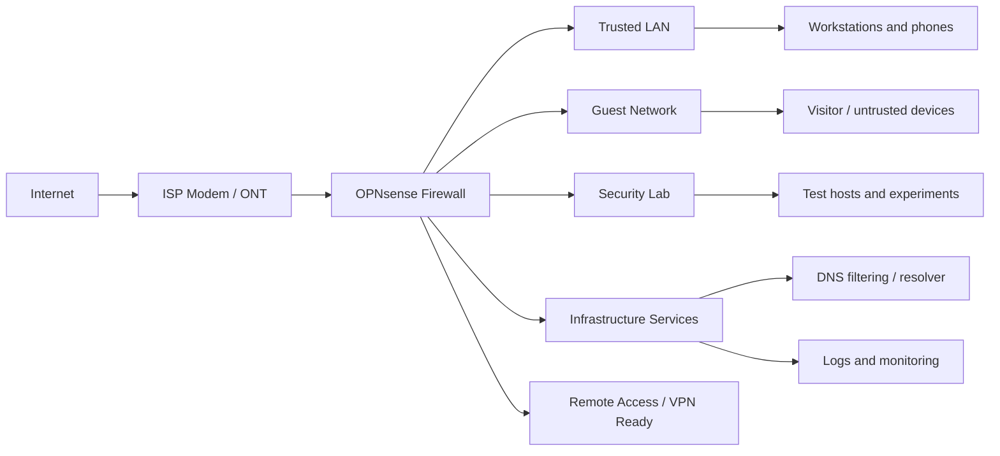

# Home Network Security

OPNsense production firewall for a personal network security perimeter: firewall policy, IDS/IPS, DNS security, segmentation, VPN-ready access patterns, and operational documentation.

This repository documents a live home lab / production network build without publishing sensitive configuration exports, public IPs, secrets, hostnames, or private management details. The goal is to show the engineering decisions, security controls, and operational habits behind the environment while keeping the actual network safe.

## At A Glance

- OPNsense edge firewall used as the primary network security control plane.
- Default-deny mindset for inbound exposure.
- Segmented trust zones for trusted clients, guest devices, infrastructure, and lab systems.
- DNS security and filtering to reduce malicious, tracking, and unwanted resolution.
- IDS/IPS-ready monitoring model for suspicious traffic and policy tuning.
- Administrative access kept private and scoped to trusted management paths.
- Documentation-first approach: design notes, redaction rules, change tracking, and validation checklist.

## Architecture

## Security Goals

This project is built around practical defensive goals:

- Reduce attack surface by keeping inbound services closed unless explicitly required.
- Separate high-trust devices from guest and lab traffic.
- Make DNS activity more visible and easier to control.
- Create a place to safely test security tools without putting daily-use systems at unnecessary risk.
- Keep firewall administration private, deliberate, and documented.
- Preserve evidence of design decisions without exposing reusable attack information.

## Control Areas

| Area | Implementation Direction | Portfolio Evidence |
|---|---|---|
| Perimeter firewalling | OPNsense rules and NAT policy | Sanitized rule intent, not raw exports |
| Segmentation | Separate zones for trusted, guest, lab, and infrastructure traffic | Architecture diagram and zone descriptions |
| DNS security | Resolver/filtering approach for safer name resolution | Policy goals and example categories |
| IDS/IPS | Suricata-capable inspection and alert review workflow | Detection workflow and tuning notes |
| Admin security | Private management access and least-exposure administration | Redaction checklist and operating rules |
| Operations | Backups, updates, validation, and change notes | Maintenance checklist |

## Design Principles

### 1. Start With Trust Boundaries

The network is treated as multiple zones rather than one flat LAN. Daily-use devices, guests, infrastructure services, and lab systems should not all receive the same level of trust.

### 2. Keep Exposure Intentional

Inbound access is avoided by default. If a service needs to be reachable, the safer pattern is to document the reason, scope the source/destination, prefer VPN-style access, and review it later.

### 3. Log Enough To Investigate

Security controls are useful only when their output can be reviewed. The firewall, DNS layer, and IDS/IPS layer should produce enough signal to answer what happened without drowning routine use in noise.

### 4. Document Without Leaking

A security portfolio should prove capability, not publish a target map. This repository uses sanitized diagrams and control descriptions instead of raw firewall backups or real host details.

## What Is Intentionally Not Published

- Public IP addresses.
- Firewall backup exports.
- VPN keys, certificates, pre-shared keys, tokens, or credentials.
- Full internal IP plans or host inventories.
- Real device names, usernames, MAC addresses, serial numbers, or ISP details.
- Screenshots that reveal sensitive DNS, DHCP, ARP, VPN, or firewall state.

## Validation Checklist

Use this as a recurring review list when maintaining the environment:

- Confirm WAN-side administrative access is disabled.
- Review inbound NAT and firewall rules for unnecessary exposure.
- Confirm guest and lab networks cannot reach trusted client systems unless explicitly intended.
- Review DNS filtering effectiveness and false positives.
- Check IDS/IPS alerts for repeated noise, blocked activity, and tuning opportunities.
- Confirm backups exist and are stored securely.
- Verify firmware/plugin updates are applied on a controlled schedule.
- Review documentation after meaningful network changes.

## Repository Structure

- `README.md`: project overview and public-facing case study.
- `docs/architecture.md`: sanitized architecture and zone model.
- `docs/operations.md`: maintenance and validation workflow.
- `docs/redaction-guide.md`: rules for safely sharing network security work.
- `LINKEDIN.md`: profile project entry and launch post draft.
- `SECURITY.md`: guidance for reporting security concerns about the repository.

## Status

Live personal network project. Documentation is intentionally sanitized and will evolve as the environment changes.
