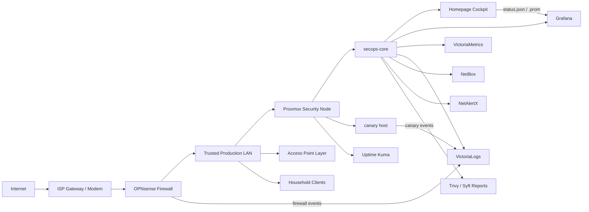

# Home Network Security

  

Sanitized documentation for a production home network security modernization project: OPNsense at the edge, a lightweight Proxmox security control plane, Homepage as the internal cockpit, Grafana for deep metrics, Uptime Kuma for availability, NetBox as the source of truth, VictoriaMetrics/VictoriaLogs for telemetry, OpenCanary for deception, and Trivy/Syft for supply-chain visibility.

The network supports normal daily use: work, school, gaming, streaming, phones, access points, monitoring, and security learning. That changed the engineering standard. This is not treated as a disposable homelab. Stability, rollback, backup validation, low latency, and no lockouts are first-class requirements.

This public repository does not contain secrets, raw configuration exports, public IP addresses, MAC addresses, serial numbers, full host inventory, browser screenshots, API keys, passwords, tokens, private hostnames, or sensitive screenshots.

## At A Glance

- OPNsense remains the enforcement point for routing, firewall policy, DNS, DHCP, and edge security.
- Proxmox runs the lightweight visibility and control-plane services without sitting inline with network traffic.
- Homepage is the primary internal HomeNet Cockpit.
- Glance was tested and used earlier, then retired from active use after the Homepage cockpit migration.
- Grafana remains the deep metrics and dashboarding layer.
- Uptime Kuma remains the uptime and alerting view.
- NetBox is the source of truth for core inventory and planned segmentation.
- VictoriaMetrics and VictoriaLogs provide metrics and log backends.
- OpenCanary provides high-signal deception.
- NetAlertX provides local unknown-device awareness.
- Trivy and Syft provide vulnerability and SBOM visibility without automatic remediation.
- UPnP/NAT-PMP was disabled to reduce unnecessary exposure.
- Proxmox rpcbind was disabled after confirming NFS was not in use.
- WireGuard, endpoint agents, and VLAN migration were deferred until controlled testing paths are ready.
- No dashboard or admin console is exposed to the public internet.
- No raw Docker socket is mounted into the cockpit.
- OPNsense, Proxmox, and access point admin UIs are linked, not embedded.

## Current Architecture

## HomeNet Cockpit

Homepage is now the daily front door. It is internal-only and designed to answer the first operational questions quickly:

- Is the network healthy?
- Is DNS working?
- Is the firewall reachable?
- Is Proxmox healthy?
- Are backups fresh?
- Is security quiet?

The cockpit serves sanitized local feeds:

- `/cockpit/status.json`
- `/cockpit/home_network_status.prom`
- `/cockpit/phase-notes.html`

The dashboard includes Mission Status, Security Snapshot, Recovery Snapshot, observability links, inventory links, and documentation links. Privileged admin interfaces are not embedded in iframes.

See [docs/homepage-cockpit.md](docs/homepage-cockpit.md).

## Control Areas

| Area | Current Implementation | Public Evidence |
|---|---|---|
| Perimeter firewalling | OPNsense remains the policy enforcement point | Sanitized architecture and rule intent |
| DNS security | Firewall-managed DNS path with resolver hardening | DNS flow and operating model |
| Exposure reduction | UPnP/NAT-PMP disabled; inbound exposure avoided | Decision log |
| Control plane | Proxmox hosts visibility services, not inline enforcement | Control-plane design |
| Cockpit | Homepage primary; Glance retired | Cockpit documentation |
| Deep metrics | Grafana backed by metrics collection | Operations workflow |
| Uptime | Uptime Kuma monitors core services | Daily review workflow |
| Source of truth | NetBox tracks core assets and planned segmentation | Current-state snapshot |
| Logs | VictoriaLogs stores firewall and canary evidence | Control-plane design |
| Metrics | VictoriaMetrics supports time-series visibility | Cockpit roadmap |
| Asset awareness | NetAlertX tracks unknown-device signals | Operations workflow |
| Deception | OpenCanary provides high-signal alerts | Security controls |
| Supply-chain visibility | Trivy and Syft produce reports and SBOMs | Sprint narrative |
| Backups | Local backups, temporary off-host copy, restore-test workflow | Recovery status and roadmap |
| Remote access | Deferred because double NAT and testing path require planning | Decision log |
| Segmentation | VLANs documented but not migrated | Roadmap |

## Design Principles

### Production First

Changes are made like a small production network: back up first, change one thing at a time, verify, and keep rollback simple.

### Visibility Without Packet-Path Risk

The Proxmox node provides monitoring, logs, inventory, reports, and deception. It does not route traffic and should not break daily internet if it is offline.

### No Marketing-Driven Tool Sprawl

Tools are added only when they provide measurable defensive value. Heavy IDS/SIEM/full-packet-capture stacks are deferred unless there is hardware, maintenance time, and a clear detection goal.

### Document Without Publishing A Target Map

This repo explains the work without publishing live secrets, exact host maps, or sensitive operational data.

## What Is Not Published

- Public IP addresses.
- Raw OPNsense, Proxmox, NetBox, or dashboard configuration exports.
- API keys, passwords, tokens, private keys, recovery codes, or certificates.
- Exact private host maps or full inventory.
- MAC addresses, serial numbers, browser screenshots, or private hostnames.
- Live dashboard screenshots unless cropped and sanitized.

## Repository Structure

- `README.md`: project overview and public-facing case study.
- `docs/current-state.md`: current sanitized architecture and control-plane snapshot.
- `docs/modernization-sprint-2026-05-20.md`: modernization sprint narrative.
- `docs/decision-log.md`: architecture decision records.
- `docs/homepage-cockpit.md`: Homepage cockpit architecture and rules.
- `docs/roadmap.md`: current, next, and later work.
- `docs/operations.md`: daily and weekly operating workflow.
- `docs/proxmox-security-control-plane.md`: lightweight Proxmox control-plane case study.
- `docs/redaction-guide.md`: rules for safely sharing network security work.
- `SECURITY.md`: guidance for reporting security concerns about the repository.

## Status

Live production home-network project. Documentation is sanitized and reflects the Homepage cockpit migration and modernization sprint completed on 2026-05-20.
