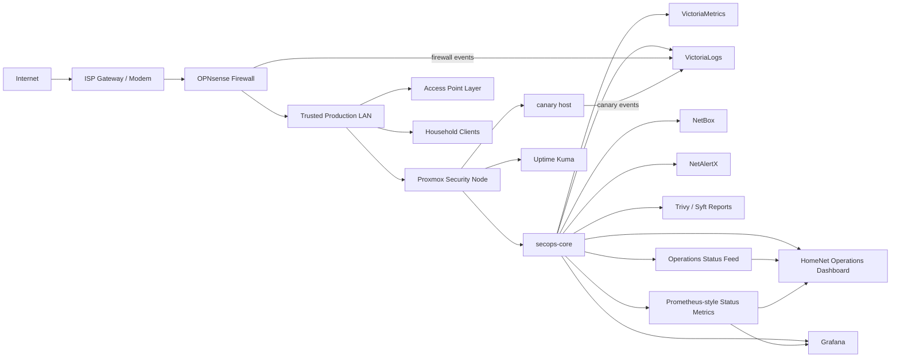

# Home Network Security

  

This is sanitized documentation from my home network security modernization project: OPNsense at the edge, Proxmox for lightweight visibility and control-plane services, and Homepage as the internal HomeNet Operations Dashboard. The goal is to show the operating model, not expose the network.

The network has to support normal daily use: work, school, gaming, streaming, phones, access points, monitoring, and security learning. That changes the standard. It cannot be a disposable lab where breaking things is fine. Stability, rollback, backup validation, low latency, and no lockouts matter.

This public repository does not contain secrets, raw configuration exports, public IP addresses, MAC addresses, serial numbers, full host inventory, browser screenshots, API keys, passwords, tokens, private hostnames, or sensitive screenshots.

## At A Glance

- OPNsense remains the enforcement point for routing, firewall policy, DNS, DHCP, and edge security.
- Proxmox runs the lightweight visibility and control-plane services without sitting inline with network traffic.
- Homepage is the primary internal HomeNet Operations Dashboard.
- Homepage serves an operations status feed, Prometheus-style status metrics, and phase notes for internal widgets.
- Glance was tested and used earlier, then retired from active use after the Homepage dashboard migration.
- Grafana remains the deep metrics and dashboarding layer.
- Uptime Kuma remains the uptime and alerting view.
- NetBox is the source of truth for core inventory and planned segmentation.
- VictoriaMetrics and VictoriaLogs provide metrics and log backends.
- OpenCanary provides high-signal deception.
- NetAlertX provides local unknown-device awareness.
- Trivy and Syft provide vulnerability and SBOM visibility without automatic remediation.
- UPnP/NAT-PMP was disabled to reduce unnecessary exposure.
- Proxmox rpcbind was disabled after confirming NFS was not in use.
- Off-host backup/restore validation, remote access choice, endpoint pilot, and VLAN segmentation remain known gaps.
- WireGuard/Tailscale, endpoint agents, and VLAN migration were deferred until controlled testing paths are ready.
- No dashboard or admin console is exposed to the public internet.
- No raw Docker socket is mounted into the dashboard.
- OPNsense, Proxmox, and access point admin UIs are linked, not embedded.

## Current Architecture

## HomeNet Operations Dashboard

Homepage is now the daily front door. It is internal-only and designed to answer the first operational questions quickly:

- Is the network healthy?
- Is DNS working?
- Is the firewall reachable?
- Is Proxmox healthy?
- Are backups fresh?
- Is security quiet?

The dashboard serves sanitized local status, metrics, and notes feeds for widgets and operations review. Public docs describe the feed purpose rather than publishing live internal paths.

The dashboard includes Mission Status, Security Snapshot, Recovery Snapshot, observability links, inventory links, and documentation links. Privileged admin interfaces are not embedded in iframes.

See [docs/homepage-operations-dashboard.md](docs/homepage-operations-dashboard.md).

## Current Status

Live production home-network project. Documentation is sanitized and updated on an ongoing basis. This repository is intentionally documentation-only: no raw configuration exports, secrets, host maps, IP addresses, or sensitive screenshots are published. The public record covers architectural intent, control rationale, design decisions, and known gaps, not operational detail. Last updated: 2026-06-07.

## Control Areas

| Area | Current Implementation | Public Evidence |
|---|---|---|
| Perimeter firewalling | OPNsense remains the policy enforcement point | Sanitized architecture and rule intent |
| DNS security | Firewall-managed DNS path with resolver hardening | DNS flow and operating model |
| Exposure reduction | UPnP/NAT-PMP disabled; inbound exposure avoided | Decision log |
| Control plane | Proxmox hosts visibility services, not inline enforcement | Control-plane design |
| Dashboard | Homepage primary; Glance retired | Dashboard documentation |
| Deep metrics | Grafana backed by metrics collection | Operations workflow |
| Uptime | Uptime Kuma monitors core services | Daily review workflow |
| Source of truth | NetBox tracks core assets and planned segmentation | Current-state snapshot |
| Logs | VictoriaLogs stores firewall and canary evidence | Control-plane design |
| Metrics | VictoriaMetrics supports time-series visibility | Dashboard roadmap |
| Asset awareness | NetAlertX tracks unknown-device signals | Operations workflow |
| Deception | OpenCanary provides high-signal alerts | Security controls |
| Active defense | Evidence-first watchlist, deception, tarpit, and reversible containment workflow | Sanitized June follow-up |
| Supply-chain visibility | Trivy and Syft produce reports and SBOMs | Sprint narrative |
| Performance guardrails | Grafana-backed thresholds protect the security stack from consuming the host | Sanitized June follow-up |
| Backups | Local backups, temporary off-host copy, restore-test workflow | Recovery status and roadmap |
| Remote access | Deferred because double NAT and testing path require planning | Decision log |
| Segmentation | VLANs documented but not migrated | Roadmap |

## Why This Matters

Home networks become hard to reason about when firewall policy, DNS behavior, asset awareness, logs, backups, and dashboard state are scattered. This project treats stability as part of security: visibility before enforcement, recovery before risky updates, and staged changes before broad rollout.

Not every security tool belongs in a daily production network. The public story is intentionally about judgment, not maximum tool count.

## Design Principles

### Production First

Changes are made like a small production network: back up first, change one thing at a time, verify, and keep rollback simple.

### Visibility Without Packet-Path Risk

The Proxmox node provides monitoring, logs, inventory, reports, and deception. It does not route traffic and should not break daily internet if it is offline.

### No Marketing-Driven Tool Sprawl

Tools are added only when they provide measurable defensive value. Heavy IDS/SIEM/full-packet-capture stacks are deferred unless there is hardware, maintenance time, and a clear detection goal.

### Document Without Publishing A Target Map

This repo explains the work without publishing live secrets, exact host maps, or sensitive operational data.

## What Is Not Published

- Public IP addresses.
- Raw OPNsense, Proxmox, NetBox, or dashboard configuration exports.
- API keys, passwords, tokens, private keys, recovery codes, or certificates.
- Exact private host maps or full inventory.
- MAC addresses, serial numbers, browser screenshots, or private hostnames.
- Live dashboard screenshots unless cropped and sanitized.

## Repository Structure

- `README.md`: project overview and public-facing case study.
- `docs/current-state.md`: current sanitized architecture and control-plane snapshot.
- `docs/results.md`: concise summary of public-safe outcomes and remaining gaps.
- `docs/modernization-sprint-2026-05-20.md`: modernization sprint narrative.
- `docs/decision-log.md`: architecture decision records.
- `docs/homepage-operations-dashboard.md`: canonical Homepage Operations Dashboard architecture and rules.
- `docs/evidence-screenshots.md`: sanitized proof screenshots.
- `docs/threat-summary-2026-05-31.md`: read-only live threat and operations summary.
- `docs/firewall-crowdsec-2026-05-31.md`: sanitized OPNsense firewall and CrowdSec telemetry sample.
- `docs/crowdsec-plain-english.md`: simple explanation of how CrowdSec supports the firewall.
- `docs/ci-audit-2026-05-31.json`: GitHub Actions workflow integrity audit for Megalodon-style CI/CD indicators.
- `docs/roadmap.md`: current, next, and later work.
- `docs/operations.md`: daily and weekly operating workflow.
- `docs/proxmox-security-control-plane.md`: lightweight Proxmox control-plane case study.
- `docs/active-defense-performance-guardrails-2026-06-07.md`: sanitized active-defense, containment, and performance-guardrail follow-up.
- `docs/redaction-guide.md`: rules for safely sharing network security work.
- `SECURITY.md`: guidance for reporting security concerns about the repository.

