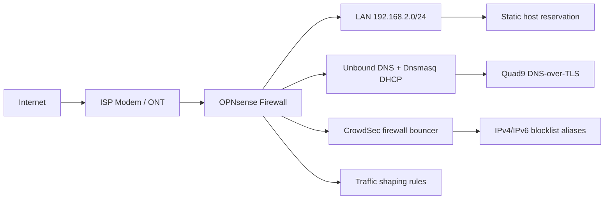

# Home Network Security

OPNsense production firewall for a personal network security perimeter: firewall policy, DNS security, CrowdSec blocking, DHCP/DNS operations, traffic-shaping work, and operational documentation.

This repository documents a live home lab / production network build without publishing sensitive configuration exports, public IPs, secrets, hostnames, or private management details. The goal is to show the engineering decisions, security controls, and operational habits behind the environment while keeping the actual network safe.

## At A Glance

- OPNsense edge firewall with DHCP WAN and a single trusted LAN.
- WAN configured to block private networks and bogon networks.
- LAN network served from `192.168.2.1/24`, with DHCP leases issued from `192.168.2.41` through `192.168.2.245`.
- Unbound DNS enabled on port 53 with DNSSEC and DNS-over-TLS forwarding to Quad9.
- Dnsmasq enabled on LAN for DHCP/local host registration support, listening on an alternate local DNS port.
- Firewall rule blocks LAN clients from bypassing local DNS by sending DNS directly to non-approved resolvers.
- CrowdSec agent, local API, and firewall bouncer enabled with IPv4/IPv6 blocklist aliases.
- Suricata IDS configuration is present but currently disabled.
- WireGuard and OpenVPN are present in the config tree but currently disabled/not instantiated.
- Traffic-shaping queues and rules exist for gaming/latency prioritization, with pipes currently disabled.
- Administrative access kept private and scoped to trusted LAN access.
- Documentation-first approach: design notes, redaction rules, change tracking, and validation checklist.

## Architecture

## Security Goals

This project is built around practical defensive goals:

- Reduce attack surface by keeping inbound services closed unless explicitly required.
- Keep LAN clients on the firewall-controlled DNS path.
- Use DNSSEC and DNS-over-TLS to improve resolver integrity and privacy.
- Use CrowdSec firewall blocking to add reputation-based protection.
- Keep the current single-LAN design documented so later segmentation can be added deliberately.
- Keep firewall administration private, deliberate, and documented.
- Preserve evidence of design decisions without exposing reusable attack information.

## Control Areas

| Area | Current Implementation | Portfolio Evidence |
|---|---|---|
| Perimeter firewalling | OPNsense WAN/LAN firewall with LAN-to-WAN NAT | Sanitized rule intent, not raw exports |
| WAN hardening | Private-network and bogon blocking enabled on WAN | Interface summary |
| DNS security | Unbound with DNSSEC and Quad9 DNS-over-TLS | Resolver flow and DNS-bypass rule |
| DHCP/local DNS | Dnsmasq on LAN with DHCP range and host reservations | Sanitized DHCP model |
| DNS enforcement | LAN DNS bypass blocked except approved local resolver | Firewall rule summary |
| CrowdSec | Agent, LAPI, firewall bouncer, and blocklist aliases enabled | Control summary |
| IDS/IPS | Suricata configuration present but disabled | Honest status and future work |
| VPN | WireGuard/OpenVPN not currently enabled | Future work |
| Traffic shaping | Gaming/latency queues and rules configured; pipes disabled | Current tuning notes |
| Operations | Backups, updates, validation, and change notes | Maintenance checklist |

## Design Principles

### 1. Start With Trust Boundaries

The current network is a single LAN behind OPNsense. That is documented honestly here because segmentation is future work, not a current control. The first trust boundary is the firewall edge plus controlled DNS.

### 2. Keep Exposure Intentional

Inbound access is avoided by default. If a service needs to be reachable, the safer pattern is to document the reason, scope the source/destination, prefer VPN-style access, and review it later.

### 3. Log Enough To Investigate

Security controls are useful only when their output can be reviewed. The firewall, DNS layer, CrowdSec, and any future IDS/IPS layer should produce enough signal to answer what happened without drowning routine use in noise.

### 4. Document Without Leaking

A security portfolio should prove capability, not publish a target map. This repository uses sanitized diagrams and control descriptions instead of raw firewall backups or real host details.

## What Is Intentionally Not Published

- Public IP addresses.
- Firewall backup exports.
- VPN keys, certificates, pre-shared keys, tokens, or credentials.
- Full internal IP plans or host inventories.
- Real device names, usernames, MAC addresses, serial numbers, or ISP details.
- Screenshots that reveal sensitive DNS, DHCP, ARP, VPN, or firewall state.

## Validation Checklist

Use this as a recurring review list when maintaining the environment:

- Confirm WAN-side administrative access is disabled.
- Review inbound NAT and firewall rules for unnecessary exposure.
- Confirm LAN clients receive the intended DHCP settings.
- Confirm LAN clients use the intended DNS path.
- Review DNS filtering effectiveness and false positives.
- Check IDS/IPS alerts for repeated noise, blocked activity, and tuning opportunities.
- Confirm backups exist and are stored securely.
- Verify firmware/plugin updates are applied on a controlled schedule.
- Review documentation after meaningful network changes.

## Repository Structure

- `README.md`: project overview and public-facing case study.
- `docs/architecture.md`: sanitized architecture and zone model.
- `docs/operations.md`: maintenance and validation workflow.
- `docs/redaction-guide.md`: rules for safely sharing network security work.
- `LINKEDIN.md`: profile project entry and launch post draft.
- `SECURITY.md`: guidance for reporting security concerns about the repository.

## Status

Live personal network project. Documentation is intentionally sanitized and based on the OPNsense configuration export reviewed on 2026-05-06.
