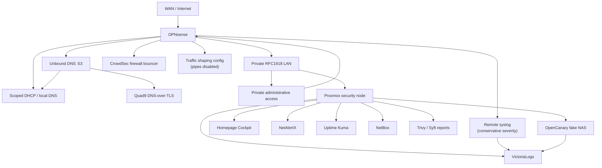

# Architecture

This document describes the public, sanitized architecture model for the OPNsense home network security project. It is written for portfolio review and is based on local OPNsense and Proxmox security-services work reviewed in May 2026.

## Zone Model

| Zone / Component | Purpose | Current State |
|---|---|---|
| WAN | Internet edge | DHCP, private-network block enabled, bogon block enabled |
| LAN | Trusted internal network | Private RFC1918 LAN |
| DHCP | Client addressing | Dnsmasq scoped DHCP range for trusted clients |
| Local DNS | LAN resolver path | Unbound on port 53 plus Dnsmasq local support on alternate port |
| CrowdSec | Reputation/blocklist enforcement | Agent, LAPI, firewall bouncer, and aliases enabled |
| IDS/IPS | Suricata inspection | Config exists, disabled |
| VPN | Remote access | WireGuard disabled, OpenVPN has no instances |
| Traffic shaping | Gaming/latency queue design | Rules/queues exist, pipes disabled |
| Proxmox security node | Visibility/control plane | LXCs/containers for cockpit, logs, discovery, canary, uptime monitoring, inventory, and on-demand reports |
| Central logs | OPNsense and canary events | VictoriaLogs with retention and disk caps |
| Deception | Fake internal NAS/server | OpenCanary enabled with safe services |
| Uptime monitoring | Service health | Uptime Kuma with SQLite |

## Traffic Philosophy

- Inbound traffic starts closed.
- WAN should not expose management access.
- LAN clients should use the firewall-controlled DNS path.
- DNS-over-TLS should use the enabled Quad9 upstreams.
- CrowdSec aliases should stay enabled and populated.
- IDS/IPS should be described as planned/available unless it is enabled.

## Sanitized Flow

## Control Notes

### Firewall Rules

Current firewall policy includes:

- A LAN block rule for TCP/UDP DNS traffic that is not destined for the approved local resolver alias.
- Default IPv4 LAN allow to any.
- Default IPv6 LAN allow to any.
- Hybrid outbound NAT from LAN to WAN.

### DNS

Unbound is enabled with DNSSEC and DNS-over-TLS entries for Quad9. Dnsmasq is enabled on LAN for DHCP/local naming support. LAN clients are intended to use the firewall DNS path rather than bypassing it.

### IDS/IPS

Suricata configuration exists, with WAN selected and syslog/EVE options present, but IDS is currently disabled. Public documentation should call this IDS-ready or planned unless it is enabled later.

### VPN-Ready Access

WireGuard is disabled and OpenVPN has no configured instances. Remote access should be treated as future work unless a VPN is enabled later.

### Security Control Plane

The Proxmox security node is deliberately not inline. It receives logs, hosts monitoring and discovery tools, provides a canary, and runs safe manual checks. Normal client traffic continues to route through OPNsense, not through the Proxmox security node.

### Laptop Host Considerations

The Proxmox node runs on laptop hardware. Lid-close and sleep behavior were configured for server-style operation, and the remaining operational concern is physical ventilation.

## Future Improvements

- Add VLAN or guest network segmentation if supported by switching/access point hardware.
- Enable and tune IDS/IPS if alert review becomes part of regular operations.
- Enable traffic-shaping pipes if the gaming/latency queue model is meant to be active.
- Add sanitized diagrams or cropped screenshots with sensitive fields blurred.
- Add an example change log for a firewall rule review.
- Reserve stable DHCP addresses for portfolio-facing internal services so dashboard links do not drift.
