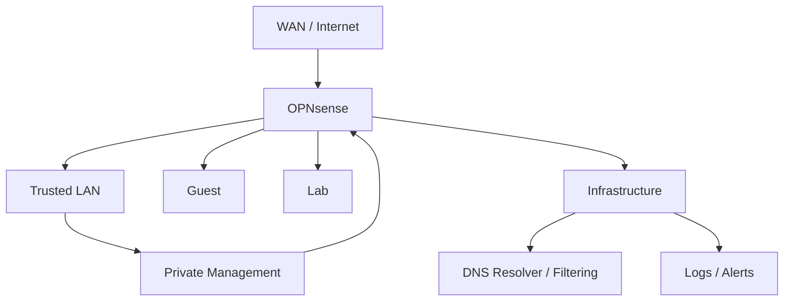

# Architecture

This document describes the public, sanitized architecture model for the OPNsense home network security project. It is written for portfolio review, not as an exact network map.

## Zone Model

| Zone | Purpose | Expected Access Pattern |
|---|---|---|
| WAN | Internet edge | No administrative exposure from WAN |
| Trusted LAN | Daily-use computers and phones | Outbound access, limited access to infrastructure |
| Guest | Visitor or untrusted devices | Internet access only |
| Lab | Security testing and experiments | Restricted access; isolated from trusted clients |
| Infrastructure | DNS, logging, and internal services | Reachable only where required |
| Management | Firewall and administrative interfaces | Private, trusted access only |

## Traffic Philosophy

- Inbound traffic starts closed.
- Inter-zone traffic must have a reason.
- Guest and lab networks should not reach trusted client systems.
- Management interfaces should not be exposed to the public internet.
- DNS and logging should be centralized enough to support review.

## Sanitized Flow

## Control Notes

### Firewall Rules

Firewall policy is organized by intent rather than convenience. Rules should answer:

- What source is allowed?
- What destination is allowed?
- What service is allowed?
- Why is the rule needed?
- When should it be reviewed?

### DNS

DNS filtering is treated as a security and visibility layer. It helps reduce unwanted resolution and creates an observable trail for troubleshooting suspicious activity.

### IDS/IPS

IDS/IPS is useful only when alerts can be reviewed and tuned. The operating model should start with visibility, identify noisy rules, and move toward blocking only where confidence is high.

### VPN-Ready Access

Remote access should favor authenticated private access patterns instead of direct administrative exposure. VPN configuration details and key material are intentionally not published.

## Future Improvements

- Add sanitized screenshots with sensitive fields blurred.
- Add an example change log for a firewall rule review.
- Add a small lab scenario showing blocked guest-to-LAN movement.
- Add a sample incident note template for IDS/IPS alert review.
