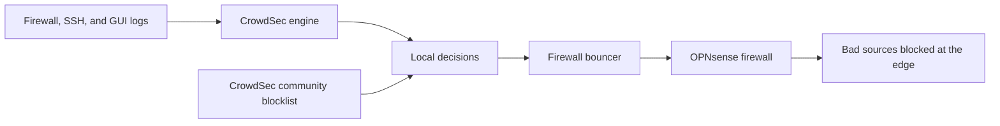

# CrowdSec in Plain English

CrowdSec is a community-powered security layer for the firewall.

The simple version:

1. It watches logs for suspicious behavior.
2. It recognizes patterns like brute force attempts, scans, and exploit attempts.
3. It turns confirmed bad behavior into decisions.
4. A firewall bouncer applies those decisions as blocks.
5. The system also receives community blocklist decisions from CrowdSec CAPI.

In this network, CrowdSec is not replacing OPNsense. OPNsense is still the firewall and enforcement point. CrowdSec adds shared threat intelligence and behavior-based detection on top of it.

## How It Fits

## What Was Verified

The production firewall was checked using read-only API calls, browser verification, and a temporary shell access path that was removed after collection.

Verified state:

| Area | Result |
|---|---|
| CrowdSec machine | 1 valid registered machine |
| Firewall bouncer | 1 valid registered bouncer |
| Local CrowdSec alert table | 0 rows during the sample window |
| Local CrowdSec decision table | 0 rows during the sample window |
| CAPI/community decisions | Active |
| CAPI decision rows sampled | 3,776 |
| Active-duration decision rows | 3,722 |
| Action type | ban |
| Decision origin | CAPI |

The OPNsense CrowdSec GUI showed no local alerts or local decisions. That does not mean CrowdSec was idle. The GUI does not show the community/CAPI blocklist decisions. Those were confirmed through the CrowdSec CLI.

## What CrowdSec Is Catching

The active community decisions were dominated by common internet noise:

| Scenario | Count |
|---|---:|
| HTTP brute force | 2,431 |
| SSH brute force | 937 |
| Generic scanning | 205 |
| TCP scanning | 194 |
| SSH exploit attempts | 9 |

In normal language: CrowdSec is helping the firewall reject known bad sources that are associated with login abuse, scans, and exploit behavior seen across the wider CrowdSec community.

## Why This Matters

This gives the network a defensive advantage without turning the firewall into a heavy IDS/IPS box.

Benefits:

- Blocks known bad sources before they matter.
- Adds community threat intelligence to OPNsense.
- Keeps detection lightweight compared with full packet inspection.
- Provides a useful story for the operations dashboard.
- Gives measurable security value without exposing management panels to the internet.

## What Was Optimized

The important optimization was validation and visibility, not adding random features.

Confirmed good:

- OPNsense remains the enforcement point.
- CrowdSec bouncer is registered and active.
- CrowdSec machine is registered and active.
- CAPI/community decisions are present.
- Local tables are quiet, which is good during a calm sample window.
- No raw Docker socket, WAN dashboard exposure, or broad dashboard credential was introduced.

Kept intentionally boring:

- No aggressive IDS/IPS tuning.
- No public dashboards.
- No raw decision rows in Git.
- No offender IP addresses published.
- No extra feeds added just for marketing points.

## How To Explain It Publicly

Short version:

> I added CrowdSec to my OPNsense firewall so the network can use community threat intelligence. OPNsense still handles enforcement, but CrowdSec supplies a live stream of known-bad behavior patterns and block decisions. In the latest read-only check, the firewall bouncer had roughly 3.7k active community ban decisions, mostly HTTP brute force, SSH brute force, and scan activity.

Portfolio version:

> The firewall uses OPNsense for enforcement and CrowdSec for collaborative threat intelligence. I validated the deployment through API checks, browser confirmation, and sanitized CLI telemetry. The local alert table was quiet, but the CAPI/community decision feed was active with thousands of current ban decisions. I published only aggregate counts and scenario names, not raw attacker IPs or internal network details.

One-sentence version:

> CrowdSec lets my firewall benefit from attacks seen by the wider community, while OPNsense remains the system that actually blocks traffic.

## Operational Rules

- Publish counts and scenario summaries only.
- Keep raw decisions local.
- Do not publish offender IPs.
- Do not publish bouncer or machine identifiers.
- Do not expose CrowdSec APIs to WAN.
- Use read-only checks for public reporting.
- Treat `cscli decisions list -a` as the source of truth for CAPI/community decisions.

## Next Improvements

1. Add a local sanitized CrowdSec summary feed for the operations dashboard.
2. Track active decision count and top scenarios over time.
3. Alert only on meaningful changes, such as bouncer disconnected, machine stale, or decisions dropping unexpectedly to zero.
4. Keep CrowdSec hub content current through the OPNsense-supported update path.
5. Re-check after OPNsense or CrowdSec plugin updates.
