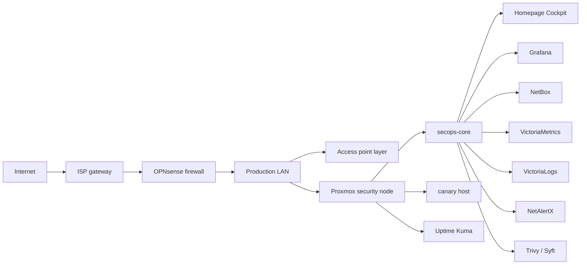

# Current State

This snapshot describes the sanitized public state of the production home network after the 2026-05-20 modernization sprint and Homepage cockpit migration.

## Executive Summary

The network is treated as a production home network, not a disposable lab. OPNsense remains the enforcement point, Proxmox provides visibility and recovery services, and Homepage is now the primary internal cockpit.

The biggest gains were exposure reduction, backup discipline, source-of-truth documentation, deception signal, supply-chain visibility, and a single internal operational dashboard. The biggest remaining gaps are durable off-host backups, staged Proxmox admin hardening, remote access planning, endpoint telemetry pilot, and VLAN migration.

## Current Architecture

## Current Control Plane

- OPNsense handles routing, firewalling, DNS, DHCP, and edge controls.
- Proxmox hosts the security-services layer on limited hardware.
- secops-core hosts the dashboard, metrics/logging components, reports, scripts, and status feeds.
- Uptime Kuma monitors core service availability.
- NetBox stores a minimal source-of-truth model and planned segmentation.
- VictoriaMetrics and VictoriaLogs provide metrics and logs.
- OpenCanary provides deception.
- NetAlertX provides local device-awareness signals.

## Current Dashboard/Cockpit

Homepage is the primary HomeNet Cockpit. Glance was retired from active use after the migration and preserved only as rollback material.

Homepage provides:

- Mission Status: Internet, DNS, Firewall, Proxmox, Backups, Security.
- Security Snapshot: canary hits, known laptop failed-login watch, CISA KEV matches, Trivy critical findings, Trivy high findings.
- Recovery Snapshot: Proxmox backup age, secops-core backup age, NetBox backup age, Trivy freshness, Syft freshness, off-host copy state, restore test state.
- Links to admin consoles without embedding privileged UIs.
- Local sanitized feeds at `/cockpit/status.json`, `/cockpit/home_network_status.prom`, and `/cockpit/phase-notes.html`.

## Current Security Controls

- UPnP/NAT-PMP disabled.
- Proxmox rpcbind disabled after confirming NFS was not used.
- CrowdSec remains part of the firewall posture.
- OpenCanary is active as a high-signal deception control.
- Trivy and Syft provide report-based visibility.
- Uptime Kuma monitors core availability.
- NetAlertX supports unknown-device review.
- Admin interfaces remain internal-only.
- Raw Docker socket is not mounted into Homepage.
- Privileged admin UIs are linked, not embedded.

## Current Recovery/Backups Status

- OPNsense config export exists outside the public repo.
- Proxmox config backup exists outside the public repo.
- secops-core backup exists outside the public repo.
- NetBox manual backup script exists and was tested.
- Homepage/Glance dashboard backups exist outside the public repo.
- A temporary laptop off-host copy was used as a stopgap.
- Non-destructive restore testing passed for key backup classes.

## Known Gaps

- No durable dedicated off-host backup target yet.
- Full VLAN migration is not complete.
- WireGuard was deferred because upstream double NAT and external testing need planning.
- Endpoint telemetry was deferred until one endpoint pilot is selected.
- Proxmox named admin, MFA, and SSH key-only hardening remain staged future work.
- Proxmox firewall is not in restrictive mode.
- Docker visibility should use docker-socket-proxy later, not the raw socket.
- Some API widgets require carefully scoped credentials and should stay least-privilege.

## What Is Intentionally Not Enabled

- Public dashboard exposure.
- Public OPNsense, Proxmox, access point, Grafana, NetBox, or Uptime Kuma exposure.
- Raw Docker socket mounting.
- Full VLAN migration.
- Broad endpoint-agent deployment.
- Automatic container remediation.
- Aggressive vulnerability scanning.
- Full-packet-capture tooling on the production LAN.
- Privileged admin-console iframe embedding.
