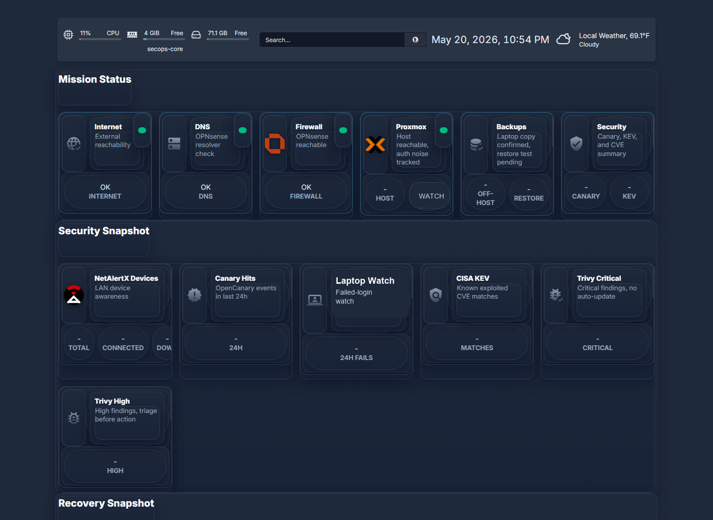
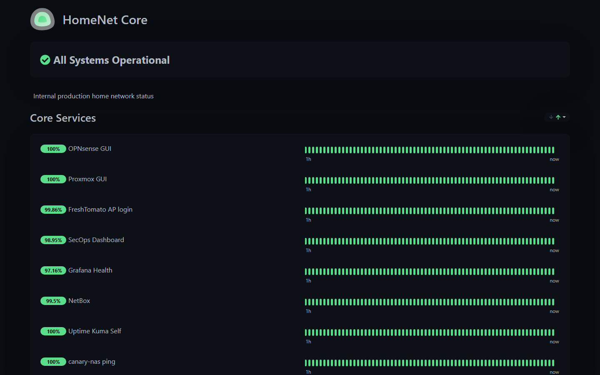
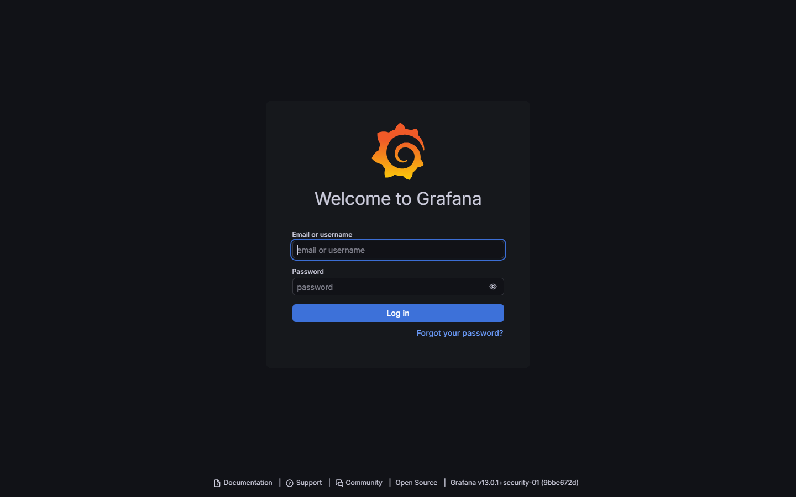
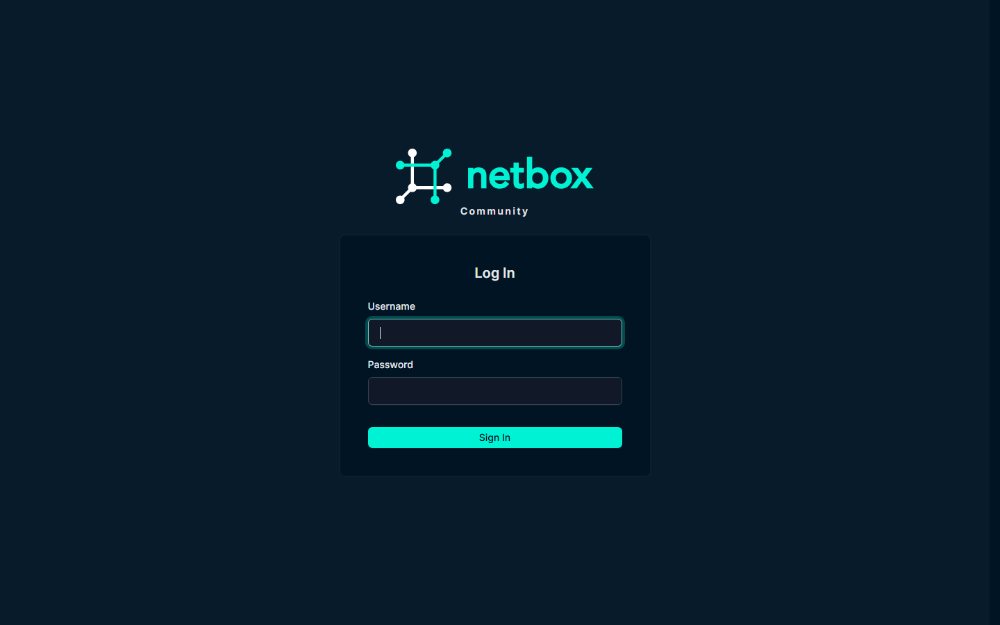

# Evidence Screenshots

These screenshots are sanitized proof points for the 2026-05-20 modernization work.

Redaction rules used:

- No browser chrome, tabs, bookmarks, extensions, or desktop notifications.
- No raw firewall, Proxmox, or dashboard configuration exports.
- No public IP addresses, MAC addresses, serial numbers, tokens, API keys, passwords, or private keys.
- No authenticated OPNsense, Proxmox, access point, NetBox inventory, or Grafana dashboard views.
- Sensitive tools are shown from login or public status views only.
- Exact internal host maps are avoided.

## HomeNet Operations Dashboard

The dashboard shows Mission Status, Security Snapshot, and Recovery Snapshot without exposing raw configuration.

## Uptime Kuma Status Page

The status page shows core service health without exposing admin credentials or raw monitor configuration.

## Grafana Login

Grafana is included as proof of the deep metrics layer, but no authenticated dashboards are shown.

## NetBox Login

NetBox is included as proof of the source-of-truth service, but no inventory is shown.

