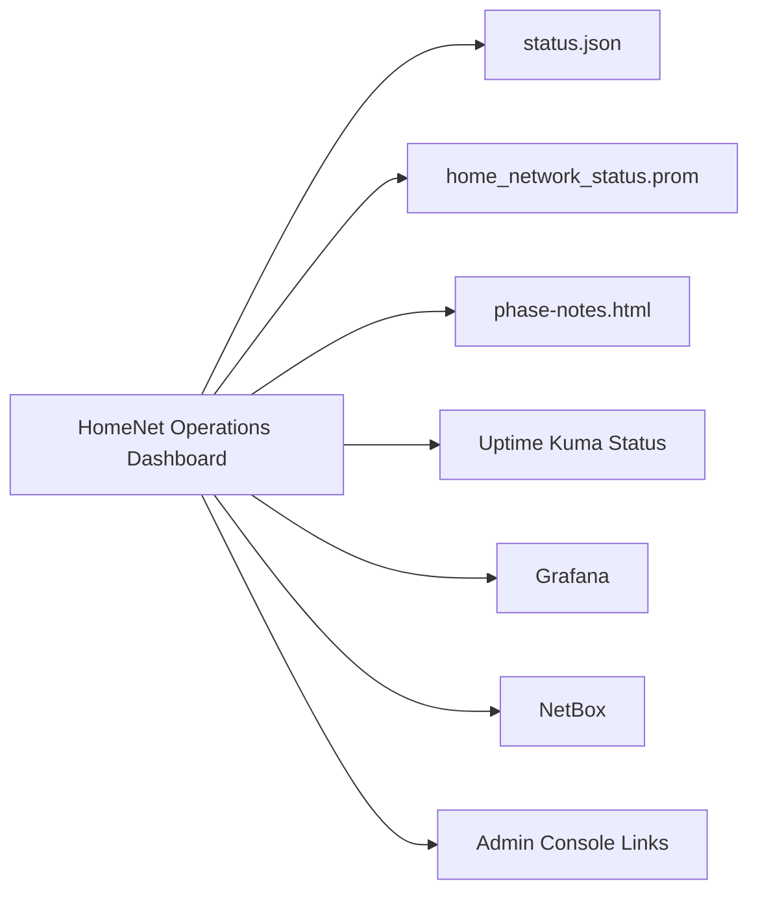

# HomeNet Operations Dashboard

## Purpose

Homepage is the primary internal dashboard for the production home network. It is designed to show status, recovery posture, security signals, and launch links from one place without exposing privileged admin interfaces.

## Why Homepage Replaced Glance

Glance was useful as a lightweight launchpad, but the network needed a richer dashboard:

- Live Mission Status.
- Security Snapshot.
- Recovery Snapshot.
- Uptime and freshness signals.
- Cleaner visual hierarchy for daily operation.
- Better path to controlled read-only widgets.

Homepage became the primary dashboard. Glance was retired from active use and preserved as rollback material.

## Dashboard Architecture

The dashboard is internal-only. It does not publish public endpoints.

## Mission Status

Mission Status answers the five-second question: does anything need attention?

- Internet.
- DNS.
- Firewall.
- Proxmox.
- Backups.
- Security.

Backups remain warning-level until durable off-host backups and restore testing are routine. Security becomes warning or critical only for meaningful signals such as canary hits, KEV matches, suspicious login activity, or unresolved high-priority vulnerability findings.

## Security Snapshot

The Security Snapshot summarizes:

- Canary hits.
- Known laptop failed-login watch.
- CISA KEV matches.
- Trivy critical findings.
- Trivy high findings.
- Device-awareness summary where safe.

It does not publish raw logs, hostnames, usernames, MAC addresses, or exact internal host maps.

## Recovery Snapshot

The Recovery Snapshot summarizes:

- Proxmox backup freshness.
- secops-core backup freshness.
- NetBox backup freshness.
- Trivy report freshness.
- Syft SBOM freshness.
- Off-host copy state.
- Restore test state.

## Status JSON Feed

The status JSON feed is a sanitized local feed for Homepage widgets. It contains operational status values, not secrets.

It should not contain:

- Passwords.
- Tokens.
- Private keys.
- Public IP addresses.
- Raw logs.
- MAC addresses.
- Exact full inventory.

## Metrics Text Feed

The metrics text feed exposes selected text-format metrics for dashboarding and later ingestion into the metrics stack.

Examples of safe metric classes:

- Backup age gauges.
- Report freshness gauges.
- Service reachability gauges.
- CVE count gauges.
- Canary hit count.
- Failed-login watch count.

Labels should remain low-cardinality and sanitized.

## What Is Linked vs Embedded

Linked:

- OPNsense.
- Proxmox.
- Access point admin.
- Grafana.
- NetBox.
- Uptime Kuma.
- Logs and reports where safe.

Not embedded:

- OPNsense admin UI.
- Proxmox admin UI.
- Access point admin UI.
- Any privileged app that depends on clickjacking protections.

## What Is Intentionally Not Included

- WAN exposure.
- Raw Docker socket.
- Privileged admin iframes.
- API keys in YAML.
- Browser screenshots.
- Raw firewall or Proxmox exports.
- Full internal device inventory.

## Widget Roadmap

| Widget | Status | Notes |
|---|---|---|
| OPNsense read-only view | Partial | Prefer exporter-backed metrics or a narrow read-only API path. |
| Proxmox read-only widget | Implemented internally | Uses a dedicated token, not a root password. |
| Grafana widget | Implemented internally | Uses a dedicated account; permissions should stay documented and reviewed. |
| Uptime Kuma status page widget | Implemented internally | Internal status page only. |
| NetAlertX widget | Partial | Summary values only; do not publish device details. |
| CrowdSec widget | Planned | Defer unless API access is safe and internal. |
| Docker status | Planned | Use docker-socket-proxy later, never raw socket. |

## Security Rules

- Internal-only.
- No WAN exposure.
- No raw Docker socket.
- No privileged iframes.
- No secrets in YAML.
- No public status pages with sensitive labels.
- No API credentials in public documentation.
- No public screenshots unless cropped and sanitized.
