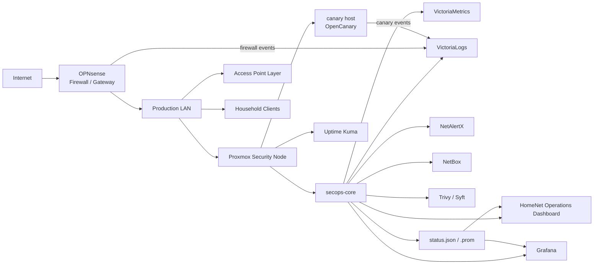

# Lightweight Proxmox Security Control Plane

This document describes the Proxmox-based security-services node that supports the OPNsense production home network without sitting inline or slowing normal use.

The design target is practical defensive value on limited hardware. Heavy SIEM stacks, broad agents, full packet capture, and always-on aggressive scanning are intentionally avoided unless a controlled maintenance plan exists.

## What Was Built

The Proxmox node hosts a small set of services:

| Service Area | Role | Why It Exists |
|---|---|---|
| HomeNet Operations Dashboard | Daily front door | Mission Status, security snapshot, recovery snapshot, and launch links |
| Uptime Kuma | Availability monitoring | Core service health and status history |
| Grafana | Deep metrics | Rich panels for metrics and trends |
| VictoriaMetrics | Metrics backend | Time-series storage/query path |
| VictoriaLogs | Log backend | Firewall, canary, and operational evidence |
| NetBox | Source of truth | Core inventory and planned segmentation |
| NetAlertX | Asset awareness | Unknown-device and device-state review |
| OpenCanary | Deception | High-signal fake internal service interactions |
| Trivy/Syft | Supply-chain visibility | Vulnerability reports and SBOMs |
| Backup/freshness scripts | Recovery operations | Backup age, report freshness, and failed-login watch |

Glance was previously used as a lightweight dashboard. It has been retired from active use and preserved only as rollback material.

## Architecture

## Why This Shape

### OPNsense Stays The Enforcement Point

The firewall remains the system that makes network policy decisions. The Proxmox node improves visibility, recovery, and documentation. It does not become an inline dependency.

### LXCs And Containers Where They Fit

The always-on services run on limited hardware, so low-overhead services are preferred. Docker is used inside the service container where it helps package dashboards and telemetry tools. The Proxmox host itself stays focused on virtualization.

### Homepage As The Dashboard

Homepage is the primary front door because the operator needs a bird's-eye view:

- Mission Status.
- Security Snapshot.
- Recovery Snapshot.
- Uptime and freshness signals.
- Links to deeper tools.

Privileged admin consoles are linked, not embedded.

### status.json And Prometheus Text Metrics

The dashboard uses local sanitized feeds:

- `status.json` for live widget values.
- `home_network_status.prom` for metrics that can later be graphed.

These feeds should never contain secrets, raw logs, public IPs, exact host maps, MAC addresses, or credentials.

### NetBox As Source Of Truth

NetBox documents core infrastructure and planned segmentation. It is not authoritative for firewall automation yet.

### Trivy/Syft For Recurring Visibility

Trivy and Syft create vulnerability and SBOM visibility. They are used for triage and planning, not automatic remediation.

### Backup/Freshness Scripts

Freshness scripts track whether backups and reports are recent enough to trust. They are part of the operational workflow and should be included in backup scope.

## Performance Decisions

The design intentionally avoids controls that would interfere with latency or throughput:

- No inline proxy.
- No IDS/IPS blocking in production path.
- No scheduled aggressive vulnerability scans.
- No full packet capture.
- No broad endpoint-agent deployment.
- No raw Docker socket in the dashboard.

## Current Hardening Posture

- UPnP/NAT-PMP disabled.
- rpcbind disabled on Proxmox because NFS was not in use.
- Homepage internal-only.
- Glance retired from active use.
- NetBox credential file protected outside public docs.
- Dashboard secrets are not stored in the public repo.
- Container updates are gated by backups and restore testing.

## Future Hardening

- Durable off-host backup target.
- Restore test after off-host backup is in place.
- Proxmox named admin and MFA.
- SSH key-only plan.
- Proxmox firewall staging.
- One endpoint telemetry pilot.
- One wired VLAN test before household migration.
- docker-socket-proxy for container visibility.
- Least-privilege read-only API widgets after the local status-feed model is stable.

## What Stays Private

The public repository intentionally does not include:

- Raw Proxmox or OPNsense configuration exports.
- Secrets, SSH keys, API tokens, passwords, or certificates.
- Full internal IP inventory.
- MAC addresses, serial numbers, ISP details, or device names.
- Screenshots that reveal sensitive internal state.
