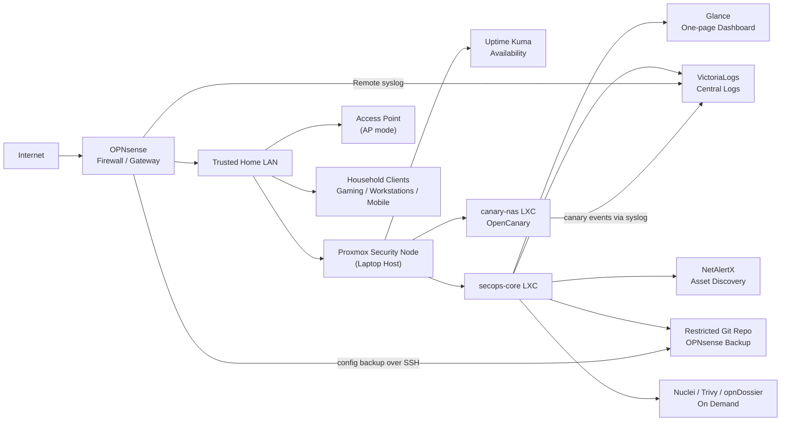

# Lightweight Proxmox Security Control Plane

This document describes the second phase of the home network security project: a lightweight security-services node built on Proxmox to support an OPNsense home network without slowing down normal internet use or gaming.

The emphasis is practical defensive value on limited hardware. The system was designed around an 8 GB RAM Proxmox host, so the architecture avoids heavy SIEM stacks, always-on vulnerability scanning, IDS/IPS blocking, and anything that would sit inline with traffic.

## What Was Built

The Proxmox node runs a small set of LXCs:

| Guest | Role | Why It Exists |
|---|---|---|
| Uptime Kuma | Availability monitoring | Simple uptime checks for the firewall, dashboard, log backend, discovery UI, canary, and access point login page |
| secops-core | Security control plane | Lightweight dashboard, centralized log backend, local asset discovery, on-demand scanners, and OPNsense config backup target |
| canary-nas | Deception host | Fake internal NAS/server intended to create high-signal alerts if touched |
| myspeed | Previous speed-test service | Preserved but stopped to save RAM and avoid unnecessary background activity |

The always-on services are intentionally small:

- Glance for a lightweight operations dashboard.
- VictoriaLogs for centralized firewall and canary logs.
- NetAlertX for local device discovery and unknown-device awareness.
- OpenCanary for a fake NAS/deception target.
- Uptime Kuma for simple service availability monitoring.

The on-demand tools are not scheduled:

- Nuclei for safe, low-rate internal baseline checks only.
- Trivy for local image and filesystem baseline scanning.
- opnDossier for offline OPNsense `config.xml` review.

## Architecture

## Why This Shape

### OPNsense Stays The Enforcement Point

The firewall remains the system that makes network policy decisions. That matters because the security node should not become a fragile inline dependency. If the Proxmox node is rebooting, updating, or offline, the home network should still route normally through OPNsense.

This also protects gaming and latency-sensitive use. No traffic is proxied through the security node, no packet inspection appliance was placed inline, and no IDS/IPS blocking was enabled from this build.

### LXCs First

Linux containers were chosen over full VMs for the always-on services because the host has limited RAM. LXCs have less overhead and are enough for this workload: logs, dashboards, discovery, and a canary. Docker was installed only inside the `secops-core` container, not on the Proxmox host.

This keeps the host clean while still allowing pinned containerized services where they make sense.

### Lightweight Logs Instead Of A Heavy SIEM

VictoriaLogs was selected as the log backend because it gives a simple searchable place for firewall and canary events without the memory footprint of heavier SIEM platforms. Retention and disk usage are capped so log collection cannot grow without bounds.

The goal is not to imitate an enterprise SOC stack at home. The goal is to have enough evidence to answer practical questions:

- Did OPNsense generate relevant events?
- Did the canary get touched?
- Did a configuration change happen?
- Is there enough context to investigate without drowning the host?

### Glance As The Front Door

Glance was used for the dashboard because it is extremely light and works well as a launchpad. It is not trying to replace VictoriaLogs, NetAlertX, or Uptime Kuma. It provides one place to start:

- What is up?
- Where do I click next?
- What does each tool mean?
- What are the safe manual actions?

The dashboard uses local assets and CSS only. It does not depend on external images or scripts.

### NetAlertX For Awareness, Not Aggressive Scanning

NetAlertX is scoped to the local LAN and is used for unknown-device awareness. The configuration was adjusted to avoid scanning Docker bridge networks, reducing noise and keeping discovery focused on actual LAN devices.

The NetAlertX backend port exposed by host networking was blocked locally from LAN access while leaving the UI working.

### OpenCanary For High-Signal Events

The canary is intentionally simple: fake HTTP, SSH, and FTP services that resemble an internal NAS/server. This is useful because normal users and normal applications should not be touching the fake NAS.

If it gets touched, that is a high-signal event worth investigating.

### On-Demand Scanning Only

Nuclei and Trivy are installed for manual use, not scheduled automation. Nuclei is scoped to known internal targets and safe templates by default. This avoids creating noisy scans or accidentally testing anything outside the authorized home network.

## Gaming And Performance Decisions

The design intentionally avoids controls that would interfere with latency or throughput:

- No inline proxy.
- No IDS/IPS blocking.
- No scheduled vulnerability scans.
- No heavy dashboard stack.
- No Zenarmor-style packet inspection on the firewall.
- No automatic container updates.
- UPnP/NAT-PMP was left enabled on OPNsense because it may be needed for open NAT behavior.

The security node is a visibility and control-plane system, not a traffic-processing system.

## Laptop Host Hardening

Because the Proxmox host is a laptop, lid-close behavior was configured for server use:

- Lid close is ignored.
- Idle sleep is ignored.
- Sleep, suspend, hibernate, and hybrid sleep targets are masked.

The remaining physical consideration is ventilation. A closed laptop can run as a small server, but it should stay plugged in and physically positioned so heat can escape.

## What Was Verified

Post-build validation covered:

- Proxmox host upgrade and reboot.
- Running kernel after upgrade.
- Container autostart behavior.
- Uptime Kuma setup with SQLite.
- Dashboard reachability and local visual assets.
- VictoriaLogs reachability and syslog ingestion.
- OPNsense remote syslog path.
- OPNsense git-backup path.
- NetAlertX UI and backend exposure.
- OpenCanary ownership of fake service ports.
- Resource headroom after all core services were running.

## What Stays Private

The public repository intentionally does not include:

- Raw Proxmox or OPNsense configuration exports.
- Secrets, SSH keys, API tokens, passwords, or certificates.
- Full internal IP inventory.
- MAC addresses, serial numbers, ISP details, or device names.
- Screenshots that reveal sensitive internal state.

The point is to show the defensive engineering decisions, not publish a reusable target map.

